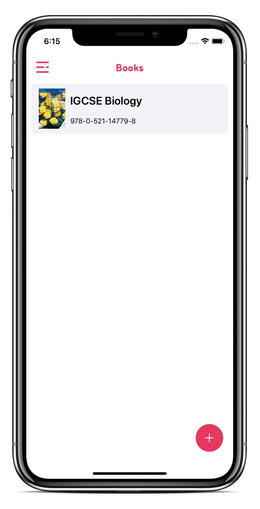
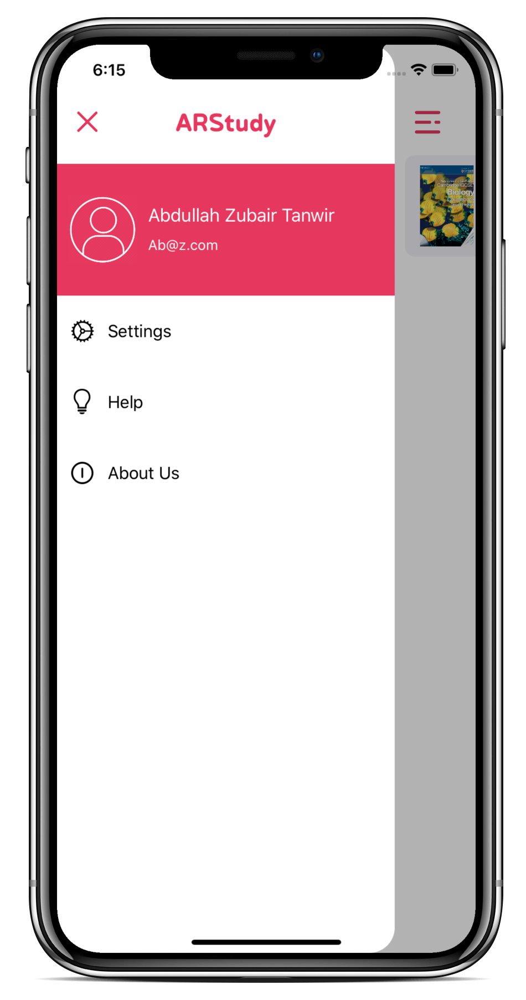
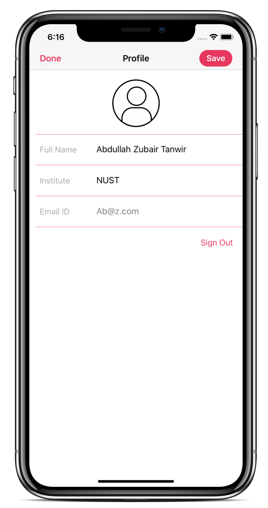
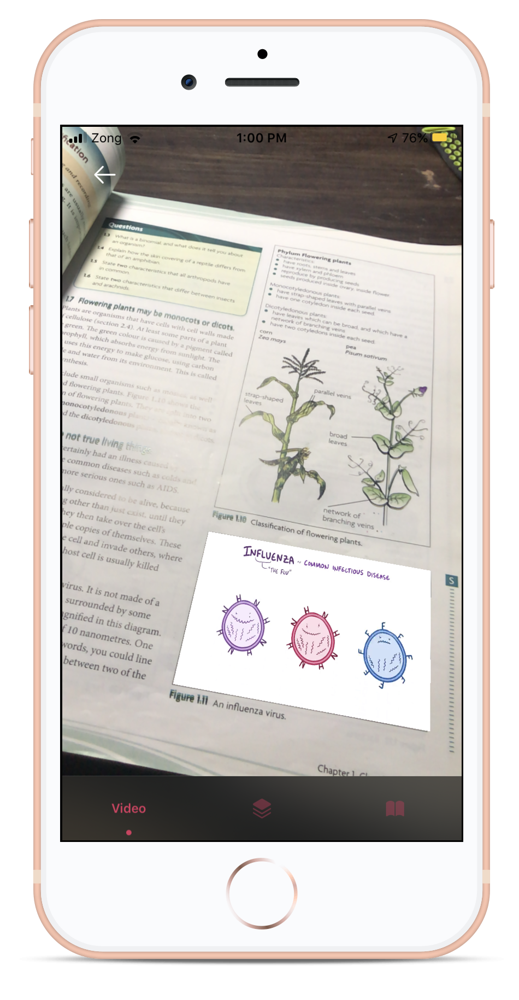
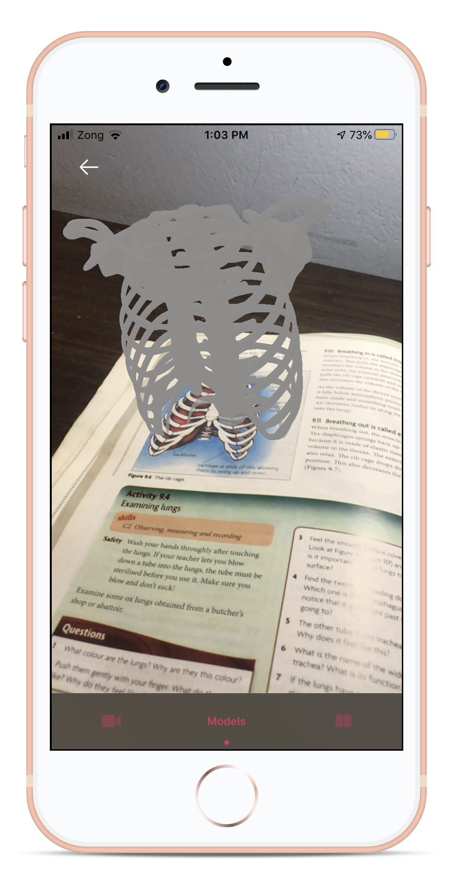
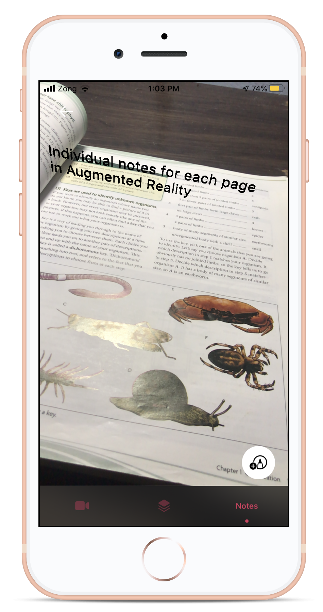

# &nbsp;&nbsp;ARStudy

An app through which you can interact with your books in Augmented Reality! You can view notes for every single page in augmented reality and modify them. Videos for pictures can be played in Augmented reality on those pictures live tracked. For diagrams in books, 3D models can be viewed in AR. Notes are saved locally and on your account, and can be viewed through online Web App. Currently, only single book is added, but project is scalable and many other books can be added easily.

### Technologies Used: ###
* Swift 5
* Firebase
* ARKit 
* Realm

&nbsp;&nbsp;&nbsp;&nbsp;&nbsp;&nbsp;&nbsp;&nbsp;&nbsp;&nbsp;&nbsp;&nbsp;&nbsp;&nbsp;

&nbsp;&nbsp;&nbsp;&nbsp;&nbsp;&nbsp;&nbsp;&nbsp;&nbsp;&nbsp;&nbsp;&nbsp;&nbsp;&nbsp;

